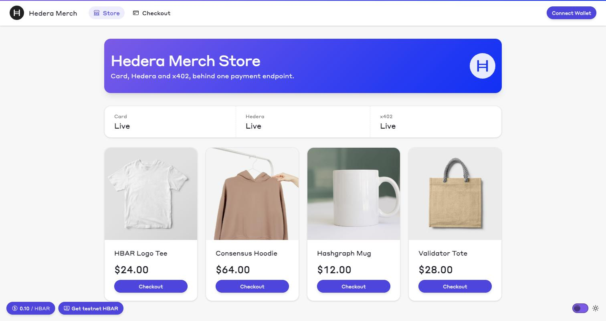
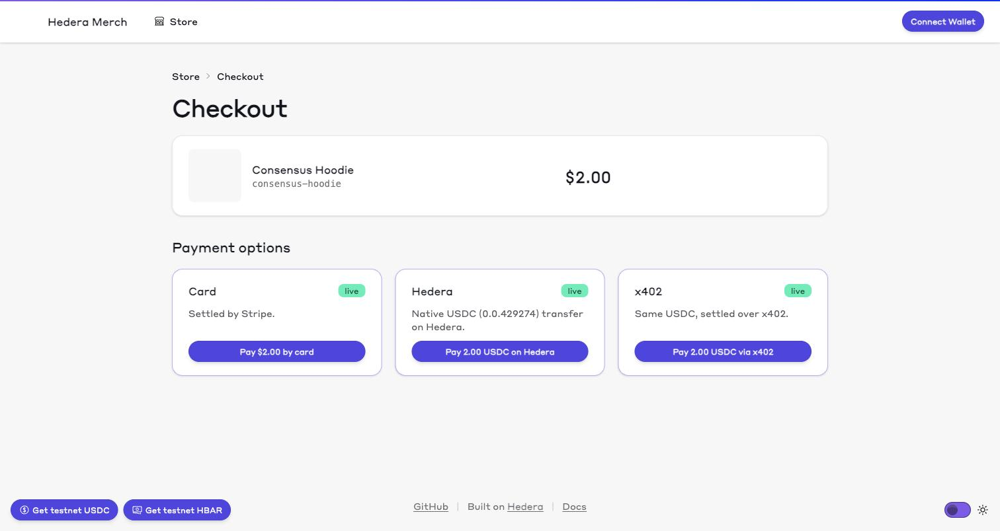

# Scaffold-HBAR — 402 Checkout

**What this is for.** `402 Payment Required` has sat in the HTTP spec since 1997 with nothing
standard behind it. Two proposals now fill it in, and both exist because the buyer is
increasingly a program — an agent, a script, a backend service — that hits a paid endpoint,
needs to be told the price in a form it can parse, pays, and retries. The **Machine Payments
Protocol** (MPP) puts that offer in a `WWW-Authenticate: Payment` header and lets one response
carry several offers at once, with nobody in the settlement path but the buyer and the
merchant. **x402** puts it in a JSON body and settles through a **facilitator** — a third
party that verifies the payment and moves the money on the server's behalf. Neither is
Stripe Checkout: if your buyer is a person with a browser, use Stripe Checkout. These are for
when your buyer is code.

Two words recur below. A **challenge** is the `402` response describing what to pay; a
**rail** is one way to pay it (a card, an on-chain transfer). This template implements both
protocols against one storefront so you can read them against the same product and the same
$0.75 — [`docs/mpp-vs-x402.md`](docs/mpp-vs-x402.md) is the line-by-line comparison.

Concretely: a merch storefront whose `/api/pay` answers `402` with **one challenge
advertising two rails at once** — a Stripe card charge and a native Hedera USDC transfer —
with `/api/x402` serving the same product, the same amount and the same merchant account as
an x402 challenge beside it.

**All three are rails you can ship on**, not two rails and a demo. Each settles a real
payment — a Stripe PaymentIntent, an HTS transfer confirmed on the Mirror Node, a facilitator
settlement — records an order, and lands the buyer on the same `/receipt/[id]`. The one
difference is that x402 has no connected-wallet path: its `exact` scheme on Hedera needs
signed-but-unsubmitted transaction bytes, which a wallet will not hand back, so that rail
signs with a local key. That is the protocol's constraint, not this template's.

It boots with **no `.env` file and no environment variables at all**. Each rail switches
itself on independently once its own variables are present, so a developer holding only
Stripe keys gets a live card path and honest demo stubs everywhere else.



Checkout offers all three rails against the one order, each reading its own credentials and
each answering the same `402`:



That screenshot is the template with all three rails configured. Out of the box each card
reads `demo mode` and names the variables that switch it on, and the store still runs.

## Create a project

**Prerequisites:** Node.js ≥ 20.18.3, Git, and **Yarn 3.2.3** (the repo pins it in
`.yarnrc.yml`, so `corepack enable` is enough — you do not install it yourself).

```bash
npm create scaffold-hbar@latest -- my-store --template tomrowbo/scaffold-hbar-402-checkout
```

`my-store` is the directory to create — name it whatever you like. Leave it out and the
scaffolder prompts for it, which fails outright with
`ERR_TTY_INIT_FAILED: TTY initialization failed` anywhere without an interactive terminal (CI,
a coding agent, most containers). Add `--yes` to accept the remaining defaults without
prompts.

`npm create` here runs the *scaffolder*
([`create-scaffold-hbar`](https://github.com/hedera-dev/create-scaffold-hbar)), which fetches
this template into a new directory. It is not the package manager: once that directory
exists the project is **Yarn-only**, and `npm install` or `pnpm install` will not produce a
working tree. If you already have the template checked out, skip this step and start at
`yarn install` below.

## Run it with no credentials

```bash
yarn install
yarn next:dev    # then open http://127.0.0.1:3000
```

> **Use `127.0.0.1`, not `localhost`.** Next prints `http://localhost:3000` on startup, and
> this README deliberately says `127.0.0.1` everywhere instead: `localhost` resolves to `::1`
> before `127.0.0.1` on many systems, so a Node client can get `ECONNREFUSED ::1:3000`
> against a server that is up and listening. The `yarn e2e:*` scripts hit exactly that.

**If port 3000 is busy**, Next quietly starts on 3001 instead — but the `curl` examples
below, the `yarn e2e:*` scripts and the browser snippets all assume 3000, so they will talk
to whatever else is on it. Pin a port you control and tell the scripts about it:

```bash
yarn next:dev --port 3399
export E2E_ORIGIN=http://127.0.0.1:3399    # yarn e2e:charge / e2e:x402 / e2e:stripe read this
```

Three things to expect on a first run, none of them a problem:

- **`yarn install` ends in about two dozen warnings** — 22 peer-dependency warnings
  (`YN0002`, `YN0060`) and one `YN0005` saying sharp's build was disabled, which it was, on
  purpose (see the note on `sharp` below). Several of the peer warnings name the payment
  library itself and look alarming:

  ```
  ➤ YN0060: │ @sh/nextjs@workspace:packages/nextjs provides viem (p978cc) with version 2.39.0, which doesn't satisfy what mppx requests
  ➤ YN0060: │ @sh/nextjs@workspace:packages/nextjs provides next (pc6373) with version 15.5.12, which doesn't satisfy what mppx requests
  ➤ YN0060: │ @sh/nextjs@workspace:packages/nextjs provides @hiero-ledger/sdk (p2df0b) with version 2.80.0, which doesn't satisfy what @hashgraph/hedera-wallet-connect requests
  ```

  They mean the workspace resolves one version of each shared dependency for everything that
  asks for it, and `mppx` and `@hashgraph/hedera-wallet-connect` declare ranges narrower than
  the versions wagmi and Next.js pin here. Nothing is missing and nothing is broken — both
  on-chain rails settle against exactly these versions, and the walkthrough below proves it
  on the Mirror Node. `sharp` is Next.js's optional image-optimisation dependency; this
  template ships local images and renders them `unoptimized`, so it never calls it — and
  `dependenciesMeta` in the root `package.json` tells Yarn not to build it. Without that
  a fresh install prints `YN0009: sharp couldn't be built successfully`, because sharp
  falls back to compiling from source wherever it has no prebuilt binary.
- The dev server prints `Ready in ~2.5s` and *then* compiles the first page you open, which
  takes **30–60 seconds** (`✓ Compiled / in 55.6s (11154 modules)` on a loaded laptop).
- **Every route is slow on its first visit.** Measured cold on a laptop that was also
  running other work: `/` 57s, `/checkout` 76s, `/receipt/[id]` 133s, `/api/x402` 171s. While
  a route compiles the browser shows a white page with a small spinner in the middle of it.
  It reads as a broken app rather than a slow one. It is not — the page appears when
  compilation finishes, and every later load is 0.07–0.1s.

  **None of this is production.** `yarn next:build && yarn next:serve` boots in half a second
  and serves pages in 11–41ms. If the dev server's first-visit compile is in your way, use
  that instead. One catch: a later `yarn next:dev` overwrites `.next`, so `yarn next:serve`
  then fails with `Could not find a production build in the '.next' directory` — rebuild
  before serving again.

That is the whole setup. Open <http://127.0.0.1:3000>, pick an item, and walk through
checkout. `/`, `/checkout` and `/receipt/[id]` all render; every payment control shows a
disabled **demo mode** panel naming the variables that would enable it. Nothing 404s, nothing
throws, and an unknown receipt id renders a demo receipt rather than an error.

(The pill in the bottom-left corner showing a dollar amount is the live HBAR/USD spot price —
`useFetchHbarPrice`, rendered by `components/Footer.tsx` next to the Hedera Portal faucet
link. It is Scaffold-HBAR chrome and has nothing to do with the checkout or the prices in the
catalogue, which are fixed USD amounts.)

The protocol is live even in demo mode. Ask the endpoint for a challenge:

```console
$ curl -i -H 'Accept: application/json' 'http://127.0.0.1:3000/api/pay?product=hbar-tee'
HTTP/1.1 402 Payment Required
content-type: application/problem+json
www-authenticate: Payment id="-_xEH9nHBj52K3idMY3JbZKLzk2WyzZhHqb_srQ9X6o", realm="localhost:3000",
  method="hedera", intent="charge", request="eyJhbW91bnQiOiI3NTAwMDAiLCJjdXJyZW5jeSI6IjAuMC41NDQ5IiwibWV0aG9kRGV0YWlscyI6eyJjaGFpbklkIjoyOTZ9LCJyZWNpcGllbnQiOiIwLjAuMCJ9",
  description="402 Checkout — HBAR Logo Tee", expires="2026-09-22T23:35:57.547Z",
  opaque="eyJhbW91bnRVc2QiOiIwLjc1IiwicHJvZHVjdCI6ImhiYXItdGVlIn0",
  Payment id="x_FqLNbLofS75N7jKaDnBRfZa3svPhh6ZJ_X6i2ByWk", realm="localhost:3000",
  method="stripe", intent="charge", request="eyJhbW91bnQiOiI3NSIsImN1cnJlbmN5IjoidXNkIiwibWV0aG9kRGV0YWlscyI6eyJuZXR3b3JrSWQiOiJkZW1vIiwicGF5bWVudE1ldGhvZFR5cGVzIjpbImNhcmQiXX19",
  description="402 Checkout — HBAR Logo Tee", expires="2026-09-22T23:35:57.556Z",
  opaque="eyJhbW91bnRVc2QiOiIwLjc1IiwicHJvZHVjdCI6ImhiYXItdGVlIn0"
x-mpp-demo-mode: hedera,stripe
```

(Header folded here for reading; it is one line on the wire.)

That is **one `WWW-Authenticate` header carrying two `Payment` challenges**. Base64url-decode
the two `request` blobs and the same $0.75 purchase appears priced on two different rails:

```json
{ "amount": "750000", "currency": "0.0.429274", "methodDetails": { "chainId": 296 }, "recipient": "0.0.0" }
{ "amount": "2400",     "currency": "usd",      "methodDetails": { "networkId": "demo", "paymentMethodTypes": ["card"] } }
```

> The blobs are base64**url** and **unpadded**. `base64 -d` silently truncates the last field
> and leaves you looking at what appears to be a malformed payload. Re-pad first:
>
> ```bash
> b64url() { python3 -c 'import base64,sys; s=sys.argv[1]; print(base64.urlsafe_b64decode(s + "=" * (-len(s) % 4)).decode())' "$1"; }
> b64url eyJhbW91bnQiOiI3NTAwMDAiLCJjdXJyZW5jeSI6IjAuMC41NDQ5IiwibWV0aG9kRGV0YWlscyI6eyJjaGFpbklkIjoyOTZ9LCJyZWNpcGllbnQiOiIwLjAuMCJ9
> ```

USDC base units on Hedera testnet token `0.0.429274`; cents in USD on Stripe. `recipient`
is `0.0.0` and `networkId` is `demo` because nothing is configured yet —
`x-mpp-demo-mode: hedera,stripe` says exactly which rails are stubbed. Configure a rail and
its half of this header becomes real, independently of the other.

## Getting testnet USDC

This template settles **Circle's testnet USDC, `0.0.429274`** — the token
[faucet.circle.com](https://faucet.circle.com) dispenses when you pick Hedera Testnet. One
click and the operator has a balance.

**Two traps on the way, both of which will look like the faucet silently doing nothing.**

1. **Your account probably cannot receive the token yet.** On Hedera an account must be
   associated with an HTS token before it can hold any, and an account that was auto-created
   by receiving HBAR to an alias — which is most wallet accounts — starts with zero
   auto-association slots. The faucet then has nowhere to deliver and you see no error.
   Either associate `0.0.429274` first, or send the faucet to an account with
   `max_automatic_token_associations: -1`, which associates on arrival. Check with:

   ```bash
   curl -s https://testnet.mirrornode.hedera.com/api/v1/accounts/0.0.YOURID \
     | jq '.max_automatic_token_associations'
   ```

   `-1` means you are fine. `0` means associate first. Accounts this template creates with
   `yarn make:burner` are always `-1`.

2. **Circle rate-limits to one drop every couple of hours.** If you need more than that,
   there is a second testnet USDC — `0.0.5449` — which shares the name, symbol and decimals
   and differs only in its treasury (`0.0.3923` rather than Circle's `0.0.5176`). It has no
   faucet at all, but it has deep SaucerSwap liquidity, so you can swap Portal HBAR for as
   much as you like on [testnet.saucerswap.finance](https://testnet.saucerswap.finance)
   (USDC/HBAR, pool 3). Point the store at it with `HEDERA_USDC_TOKEN_ID=0.0.5449` — no code
   change, and `mppx-hedera` verifies against whatever the challenge advertises.

> **A note on the transcripts below.** The `402` challenges were captured against Circle's
> `0.0.429274` and match what this template now serves. The *settlement* transcripts — the
> `yarn e2e:charge` runs, the faucet responses and the Mirror Node transfer lookups — were
> recorded earlier with `HEDERA_USDC_TOKEN_ID=0.0.5449`, so that is the token id you will see
> in them. The flow is identical either way; they are real captured output and are left as
> recorded rather than edited to depict a run that never happened.

**This is also why the catalogue is priced in cents.** Nothing costs more than $2.00, so a
single faucet drop covers dozens of runs across all three rails — and because each purchase
returns the USDC to the merchant, you effectively never run out. Priced like real merch, one
drop buys one item and then refuses. Change `priceUsd` in
`packages/nextjs/lib/products.ts` when you fork this — but keep everything at or above
`0.50`, which is Stripe's minimum charge. Below it mppx stops advertising the card rail
instead of failing visibly.

Both on-chain rails move Circle's testnet USDC `0.0.429274`, and the operator has to be
holding some before anything settles — `/api/testnet/fund` moves the operator's own balance
to a test buyer, it is not a mint. The Hedera Portal gives you HBAR, not USDC.

**The one click:** [faucet.circle.com](https://faucet.circle.com) → Hedera Testnet → your
operator account id. It sends 20 USDC, which at this catalogue's prices is dozens of
purchases on every rail — and because each payment returns the USDC to the merchant, you
effectively never run out. Mind the two traps above: your account needs to be able to
receive the token, and Circle rate-limits repeat requests.

### If you need more than Circle's faucet will give you

Hedera testnet carries a second USDC, `0.0.5449`, identical in name, symbol and decimals and
differing only in its treasury (`0.0.3923` rather than Circle's `0.0.5176`). It has no faucet
at all, but it has deep SaucerSwap liquidity, so you can buy as much as you like:

1. **Get testnet HBAR** from the [Hedera Portal faucet](https://portal.hedera.com/faucet) —
   100 HBAR per day against your testnet account id.
2. **Swap it for `0.0.5449`** on <https://testnet.saucerswap.finance>. Connect the operator
   account, let it associate the token, and swap. The USDC/HBAR pool (contract
   `0.0.2661044`) is the deepest market for it on testnet — check the reserves yourself
   rather than taking this README's word for it:

   ```console
   $ curl -s https://test-api.saucerswap.finance/pools/3 \
     | jq '{a: .tokenA.id, reserveA: .tokenReserveA, b: .tokenB.id, reserveB: .tokenReserveB}'
   {
     "a": "0.0.5449",
     "reserveA": "307599305282",
     "b": "0.0.15058",
     "reserveB": "13486064572365"
   }
   ```

   (`0.0.15058` is WHBAR, 8 decimals. Testnet pricing is arbitrary and bears no relation to
   the real HBAR/USDC rate — that is fine, it is play money either way.)
3. **Point the store at it:** `HEDERA_USDC_TOKEN_ID=0.0.5449`. No code change. The token
   travels in the 402 as `currency` and `mppx-hedera` verifies against whatever the challenge
   advertised.

Circle's token has the faucet and no market; this one has the market and no faucet. That is
the whole trade-off, and the variable exists so you can take either side of it.

> **Why the token id matters more than it looks.** The two are indistinguishable in logs,
> wallets and error messages — same name, same symbol, same decimals. Settle one and fund the
> other and you get `insufficient_balance` naming a token you are visibly holding. Before
> `mppx-hedera` 0.3.0 this was worse than confusing: the library accepted a configured
> `currency` when issuing the 402 and then verified against its own default, so an override
> was advertised and silently never found.


## Rail: Hedera USDC (native, no facilitator)

The buyer transfers USDC directly to the merchant account with a 32-byte MPP attribution
memo derived from the challenge id. The server re-reads that transfer from the Hedera Mirror
Node before it issues a receipt. There is no facilitator and no escrow contract in the path.

```bash
# packages/nextjs/.env
HEDERA_OPERATOR_ID=0.0.xxxxxxx
HEDERA_OPERATOR_KEY=0x...
HEDERA_RECIPIENT_ID=0.0.yyyyyyy   # optional; defaults to the operator
```

Every rail section below shows a `packages/nextjs/.env` block, but that file is only the
convenient form — plain process environment variables work identically
(`HEDERA_OPERATOR_ID=... HEDERA_OPERATOR_KEY=... yarn next:dev`). Start from
`cp packages/nextjs/.env.example packages/nextjs/.env`, which lists every variable the app
reads.

Get a testnet account and key from the [Hedera Portal](https://portal.hedera.com/).
`HEDERA_OPERATOR_KEY` accepts `0x`-prefixed ECDSA hex, bare ECDSA hex, DER, or ED25519 —
see `parseOperatorKey` in `packages/nextjs/lib/hederaOperator.ts`.

Set `HEDERA_RECIPIENT_ID` to something other than the operator if you intend to pay from the
operator account itself: a transfer from an account to itself is rejected up front with
*"Buyer and merchant are the same account"* rather than being submitted and failing on chain.

**Verify it.** Restart `yarn next:dev` and request a challenge again. `recipient` in the
decoded Hedera `request` is now your account, and `x-mpp-demo-mode` no longer lists `hedera`:

```console
$ curl -sI -H 'Accept: application/json' 'http://127.0.0.1:3000/api/pay?product=hbar-tee' | grep -i x-mpp-demo-mode
x-mpp-demo-mode: stripe
```

Then buy something — [Your first payment](#your-first-payment-hedera-testnet) below is the
step-by-step. The flow is: 402 → sign a USDC transfer carrying the attribution memo → retry
with `Authorization: Payment <credential>` → `200` with a `Payment-Receipt` header.

A settlement from this template on Hedera testnet:

```
transaction  0.0.10672305@1790118570.306232317
hashscan     https://hashscan.io/testnet/transaction/0.0.10672305@1790118570.306232317
```

Confirm it yourself against the Mirror Node — no trust in this README required:

```console
$ curl -s 'https://testnet.mirrornode.hedera.com/api/v1/transactions/0.0.10672305-1790118570-306232317' \
  | jq '.transactions[0] | {result, name, token_transfers}'
{
  "result": "SUCCESS",
  "name": "CRYPTOTRANSFER",
  "token_transfers": [
    { "token_id": "0.0.5449", "account": "0.0.8569027",  "amount": 750000,  "is_approval": false },
    { "token_id": "0.0.5449", "account": "0.0.10672305", "amount": -750000, "is_approval": false }
  ]
}
```

0.750000 USDC (`0.0.5449`, 6 decimals) moved from buyer to merchant, and the retried
request returned `200` with a matching `Payment-Receipt`. Note the Mirror Node's
transaction-id form uses hyphens (`0.0.x-seconds-nanos`) where the protocol and HashScan
use `@`.

> Testnet USDC in this template is Circle's **`0.0.429274`**. `0.0.5449` is a *different*
> testnet token with the same name, symbol and decimals; set `HEDERA_USDC_TOKEN_ID` to settle
> that one instead.

## Your first payment (Hedera testnet)

Three roles are in play, and the first-run confusion is almost always about which account is
which:

| Role | What it does | Needs | Where it comes from |
|---|---|---|---|
| **Operator** | The server's own account. Submits pull-mode transfers and funds test buyers. It never becomes the buyer. | **HBAR *and* USDC** — it pays out every top-up | `HEDERA_OPERATOR_ID` / `HEDERA_OPERATOR_KEY` — [Hedera Portal](https://portal.hedera.com/) |
| **Recipient (merchant)** | The account the USDC lands in. Advertised as `recipient` in the challenge. | Nothing; it only receives | `HEDERA_RECIPIENT_ID`; defaults to the operator |
| **Buyer** | Signs the transfer. A throwaway *burner* key, or a connected wallet. | HBAR for fees and USDC for the purchase — both handed down by the operator | You create one — step 2 |

The **operator** is the only account with funding you have to go and get: its HBAR from the
[Portal faucet](https://portal.hedera.com/faucet), its USDC from
[Getting testnet USDC](#getting-testnet-usdc-005449) above. Everything the buyer holds comes
from the operator, via `yarn make:burner` and `/api/testnet/fund`.

The Portal gives you exactly **one** testnet account, so the instinct is to make it all three.
Operator and recipient can share an account. The buyer cannot join them: a transfer from an
account to itself is rejected up front with *"Buyer and merchant are the same account"*. So
either pay from a burner and leave the operator as the merchant — what this walkthrough does —
or pay from the operator and point `HEDERA_RECIPIENT_ID` at some other USDC-associated
account.

**1. Configure the server.** Either a `.env` file or plain environment variables work; the
file is just the convenient form.

```bash
cp packages/nextjs/.env.example packages/nextjs/.env
```

```bash
# packages/nextjs/.env
HEDERA_OPERATOR_ID=0.0.xxxxxxx
HEDERA_OPERATOR_KEY=0x...
```

Start the server and confirm the rail is live — `x-mpp-demo-mode` should no longer list
`hedera`:

```console
$ yarn next:dev
$ curl -sI -H 'Accept: application/json' 'http://127.0.0.1:3000/api/pay?product=hashgraph-mug' | grep -i x-mpp-demo-mode
x-mpp-demo-mode: stripe
```

Check the operator's USDC while you are here. It funds every test buyer, and an operator
holding none is the one thing that stops this walkthrough dead — far better to learn it now
than from a `502` at step 3:

```console
$ curl -s 'https://testnet.mirrornode.hedera.com/api/v1/accounts/0.0.8569027/tokens?token.id=0.0.5449' \
  | jq '.tokens[0] | {token_id, balance}'
{
  "token_id": "0.0.5449",
  "balance": 14260022
}
```

Balances are base units at 6 decimals, so `14260022` is **14.26 USDC** — comfortably more
than the $0.50 mug this walkthrough buys. `null`, or an empty `tokens` array, means the
operator has never held the token at all; [Getting testnet USDC](#getting-testnet-usdc-005449)
fixes either case.

**2. Make a burner buyer.** A burner is an ECDSA key whose Hedera account you do not care
about. Generating the key is the easy part; the key has no account until HBAR lands on its
EVM alias, and the buyer needs HBAR of its own to pay transaction fees. `yarn make:burner`
does all of that from the operator account (testnet only — it refuses to run otherwise):

```console
$ yarn make:burner
account   0.0.10761282
evm       0x398060b33edb4d47e2d0e74a16d3255737b1a890
hbar      10
key       c97af255da1f636cbaf42b0cafca93f492f04cc9ed117b1c1678a9cfe7580763

Pay with it from the command line:
  yarn e2e:charge c97af255da1f636cbaf42b0cafca93f492f04cc9ed117b1c1678a9cfe7580763 hashgraph-mug

To pay in the browser instead, connect a wallet on the checkout page — this key
is not used there.
```

It still holds no USDC. That is what `/api/testnet/fund` is for.

The same key is printed twice there in two different shapes — bare hex on the `e2e:charge`
line, `0x`-prefixed on the `localStorage` line — and `HEDERA_OPERATOR_KEY` in the block above
is `0x`-prefixed as well. **All three accept both forms.** `e2e:charge`, `e2e:x402` and the
browser each strip a leading `0x` before parsing, and `parseOperatorKey` additionally takes
DER and ED25519. The shapes differ only because that is how each line is conventionally
written; copy whichever line you need, whole.

**3a. Pay from the command line.** With the server running, `yarn e2e:charge` runs the whole
protocol — challenge, faucet top-up, signed transfer, retry with the credential, receipt:

```console
$ yarn e2e:charge c97af255da1f636cbaf42b0cafca93f492f04cc9ed117b1c1678a9cfe7580763 hashgraph-mug
1. challenge status: 402
   www-authenticate: Payment id="htv6tYtHWomdY3QShSm-E-Cltwmmqj1Det-FF2k4uuc", realm="localhost:3000", method="hedera", intent="charge", requ ...
2. parsed: {
  id: 'htv6tYtHWomdY3QShSm-E-Cltwmmqj1Det-FF2k4uuc',
  realm: 'localhost:3000',
  amount: '500000',
  tokenId: '0.0.5449',
  recipient: '0.0.8569027'
}
3. memo: 0xef1ed71201799e61a18946a19f71c4000000000000000000001ac6d4282fc898
4. buyer: 0.0.10761282 usdc: null
5. fund: 200 {"funded":true,"accountId":"0.0.10761282","tokenId":"0.0.5449","amount":"500000","needed":"500000"}
   buyer usdc now: null
6. signed transfer, submitting credential (pull mode)…
7. settled status: 200
   payment-receipt: eyJtZXRob2QiOiJoZWRlcmEiLCJyZWZlcmVuY2UiOiIwLjAuMTA3NjEyODJAMTc5MDYwNTY1Ni4yMTIxMjk3MzQiLCJzdGF0dXMiOiJzdWNjZXNzIiwidGltZXN0YW1wIjoiMjAyNi0wOS0yOFQxNDoyNzo0Ny43OTJaIn0
   body: {"orderId":"htv6tYtHWomdY3QShSm-E-Cltwmmqj1Det-FF2k4uuc","receiptUrl":"/receipt/htv6tYtHWomdY3QShSm-E-Cltwmmqj1Det-FF2k4uuc",
          "product":{"id":"hashgraph-mug","name":"Hashgraph Mug","priceUsd":"0.50"},
          "transactionId":"0.0.10761282@1790605656.212129734",
          "hashscanUrl":"https://hashscan.io/testnet/transaction/0.0.10761282@1790605656.212129734"}
```

**On step 5, read the status before the balance.** When it says `fund: 200`, a following
`buyer usdc now: null` is the Mirror Node still catching up, not a failed top-up — the
transfer in step 6 goes through regardless. That is the only case this reassurance covers.
Any other status is a real failure with a real cause, and the script stops there and prints
it rather than signing a transfer the buyer cannot pay for:

```console
5. fund: 502 {"error":"operator_underfunded","detail":"Operator 0.0.8569027 holds 0.120000 USDC (token 0.0.5449) on testnet, which is not enough to send the buyer the 2.000000 this top-up needs. Get testnet HBAR from https://portal.hedera.com/faucet and swap it for token 0.0.5449 on https://testnet.saucerswap.finance ..."}

   Could not fund the buyer, and it holds 0 of 0.0.5449.
   Operator 0.0.8569027 holds 0.120000 USDC (token 0.0.5449) on testnet, which is not enough
   to send the buyer the 2.000000 this top-up needs. …
```

Confirm the settlement yourself:

```console
$ curl -s 'https://testnet.mirrornode.hedera.com/api/v1/transactions/0.0.10761282-1790605656-212129734' \
  | jq '.transactions[0] | {result, name, token_transfers}'
{
  "result": "SUCCESS",
  "name": "CRYPTOTRANSFER",
  "token_transfers": [
    { "token_id": "0.0.5449", "account": "0.0.8569027",  "amount": 500000,  "is_approval": false },
    { "token_id": "0.0.5449", "account": "0.0.10761282", "amount": -500000, "is_approval": false }
  ]
}
```

**3b. Or pay in the browser.** Connect a Hedera wallet with **Connect Wallet**, open
`/checkout`, and pay. Both on-chain rails sign with the wallet — there is no key in the page
and nothing to paste into a DevTools console. The wallet needs USDC of its own, since the
faucet below funds the CLI's throwaway buyer rather than your wallet.

Verified against HashPack on Circle's `0.0.429274`:

| Rail | Transaction | Submitted by |
|---|---|---|
| MPP | `0.0.10827845@1790966342.370842370` | the buyer — carries the attribution memo |
| x402 | `0.0.9839454@1790966274.065436899` | the facilitator, which also pays the fee |

The two are told apart by exactly that: an MPP charge is submitted by the buyer under its own
transaction id and carries the 32-byte memo; an x402 settlement is submitted by the
facilitator under *its* id, with no memo, because the buyer never broadcasts.

To top up a buyer by hand:

```console
$ curl -s -X POST -H 'Content-Type: application/json' \
    -d '{"accountId":"0.0.10761282","product":"hashgraph-mug"}' http://127.0.0.1:3000/api/testnet/fund
{"funded":true,"accountId":"0.0.10761282","tokenId":"0.0.5449","amount":"500000","needed":"500000"}
```

Say which item you are funding for — `product`, or `amount` in base units. Without it the
faucet has to assume the priciest thing in the catalogue; see
[`/api/testnet/fund`](#apitestnetfund) below.

A burner that has never held USDC also needs the token association, which a bare `curl` does
not do — the browser and `yarn e2e:charge` both sign that association and pass it as
`associateTransaction`.

### `/api/testnet/fund`

The test-buyer faucet. It exists because a Hedera account must *associate* an HTS token
before it can hold it, so a fresh buyer has nothing to spend and no way to receive it.

```
POST /api/testnet/fund
{ "accountId": "0.0.10761282", "amount": "500000", "associateTransaction": "<base64, optional>" }
```

- `accountId` — the buyer, as `0.0.10761282`. It must not be the operator (`400 self_funding`).
- `amount` — USDC **base units** the buyer is about to spend, as digits in a string
  (`"500000"` is 0.50 USDC). Capped at the priciest item in the catalogue.
- `product` — a catalogue id (`"hashgraph-mug"`) instead of `amount`, if you would rather the
  route do the pricing.
- `associateTransaction` — a base64 `TokenAssociateTransaction` **signed by the buyer**, which
  the operator submits on their behalf. Only needed when the buyer has never held USDC and has
  no automatic association slots; anything other than an association is rejected, so this is
  not a general transaction relay. `yarn e2e:charge` builds it for you.

It tops the buyer up to whatever was asked for, sending only the shortfall, and no-ops with
`{"funded":false,"reason":"sufficient_balance"}` if the buyer already holds enough. `503` if
the operator is not configured, `403` off testnet.

**Say what is being bought.** With neither `amount` nor `product` the route has to assume the
priciest item in the catalogue (2.00 USDC), because it has nothing else to go on — and an
operator that could comfortably cover a $0.50 mug is then refused for want of 64. Both
in-tree callers (`lib/hederaBuyer.ts` and `scripts/e2e-charge.mjs`) pass the charge amount; a
hand-written `curl` should too.

The operator must itself hold enough testnet USDC to pay out — the faucet is a convenience
over the operator's balance, not a mint. When it does not, the route says so by name:

```console
$ curl -s -X POST -H 'Content-Type: application/json' \
    -d '{"accountId":"0.0.10775466"}' http://127.0.0.1:3000/api/testnet/fund
{"error":"operator_underfunded","detail":"Operator 0.0.8569027 holds 0.120000 USDC (token 0.0.5449)
 on testnet, which is not enough to send the buyer the 2.000000 this top-up needs. Get testnet HBAR
 from https://portal.hedera.com/faucet and swap it for token 0.0.5449 on
 https://testnet.saucerswap.finance (the USDC/HBAR pool). Circle's faucet at
 https://faucet.circle.com dispenses 0.0.429274 instead, a different testnet USDC this template
 cannot verify. If the operator can cover the item being bought but not this top-up, post
 \"product\" or \"amount\" so the faucet moves only what that purchase costs."}
```

(Wrapped here for reading; it is one line on the wire.)

## Rail: Card (Stripe)

The card rail is a second MPP method on the same challenge. Browsers requesting `/api/pay`
with `Accept: text/html` get a real Stripe Elements form; agents asking for JSON get the
challenge. The form mints a Shared Payment Token through `/api/pay/token` and retries the
402 with it.

```bash
# packages/nextjs/.env
STRIPE_SECRET_KEY=sk_test_...
STRIPE_PUBLISHABLE_KEY=pk_test_...
STRIPE_NETWORK_ID=profile_test_...   # your Stripe profile id
```

All three are required — `hasStripe()` in `packages/nextjs/lib/demo.ts` is an AND.

### Where `STRIPE_NETWORK_ID` comes from

It is a **Stripe profile** id, and the profile is a one-time Dashboard step that nothing
else in this template can do for you. Go to
[dashboard.stripe.com/profiles](https://dashboard.stripe.com/profiles), click **Get
started**, and give it a display name and a handle. Create it in the same sandbox your
`sk_test_` key belongs to — a live-mode profile issues a `profile_...` id that a test key
cannot use. Then read the id back:

```console
$ curl -s https://api.stripe.com/v2/network/business_profiles/me \
    -u sk_test_...: -H 'Stripe-Version: 2026-07-29.preview'
{"id":"profile_test_...", ...}
```

Before the profile exists that call answers `404 {"code":"not_found","message":"Stripe
business profile not found."}`, which is the error to expect if you skip this step.

A caveat worth knowing before you spend time on it: **in a sandbox the id is advertised but
never enforced.** It travels in the 402 so an agent wallet knows who to mint a token for, but
the test-mode SPT helper grants to whichever account the secret key belongs to and ignores it.
So a sandbox payment settles with any non-empty value. Only a real agent wallet — Onelink, in
live mode — needs the id to be the true one.

**Verify it.** With Stripe unconfigured the token endpoint refuses in a readable way:

```console
$ curl -s -X POST -H 'Content-Type: application/json' -d '{}' http://127.0.0.1:3000/api/pay/token
{"error":"demo_mode","detail":"Set STRIPE_SECRET_KEY, STRIPE_PUBLISHABLE_KEY and STRIPE_NETWORK_ID to enable card payments."}
```

Configure the three variables and restart. `yarn e2e:stripe` then walks the whole rail
headlessly — it reads the `stripe` challenge, mints a Shared Payment Token against Stripe's
`pm_card_visa` test card, and replays the 402 with it:

```console
$ yarn e2e:stripe hbar-tee
1. challenge status: 402
2. parsed: { id: '1SJ_2g3…', amount: '2400', currency: 'usd', networkId: 'profile_test_…' }
3. minting SPT for pm_card_visa …
4. spt: spt_1UL1AeQud7O6ztzYMx5VpkI7
5. retrying with the credential…
6. settled status: 200
   payment-receipt: eyJtZXRob2QiOiJzdHJpcGUiLCJzdGF0dXMiOiJzdWNjZXNzIiw…

✓ card payment settled: pi_3UL1AeQud7O6ztzY0IgjCuWS
```

That `pi_` id is the check that matters — look it up under **Payments** in the Dashboard, or
`curl https://api.stripe.com/v1/payment_intents/pi_... -u sk_test_...:`. It carries
`metadata.mpp_challenge_id` tying it back to the challenge the credential was issued for.

In the browser, **Pay by card** on `/checkout` goes to `/api/pay`, where mppx serves a Stripe
Elements form. Pay with `4242 4242 4242 4242`, any future expiry, any CVC; the form replays
the request through a service worker and the route redirects to `/receipt/[id]`.

The card offer is advertised in the 402 **even when Stripe is unconfigured** — deliberately,
so that a developer running this template with no keys still sees the two-rail challenge that
is the point of it. Demo mode is made honest in the UI (a disabled `demo mode` panel), not by
deleting the offer. See [`docs/card-and-crypto.md`](docs/card-and-crypto.md).

## Rail: x402

x402 is a different protocol, not another MPP method: a JSON-body 402 that settles through a
facilitator. It sits beside the MPP endpoint so the two can be read against the same store.

```bash
# packages/nextjs/.env
AX402_FACILITATOR_URL=https://testnet.facilitator.ax402.io
```

**Verify it.** Check that the facilitator will actually settle on Hedera before you rely on
it — its `/supported` endpoint advertises what it can do:

```console
$ curl -s https://testnet.facilitator.ax402.io/supported \
  | jq '.kinds[] | select(.network | startswith("hedera"))'
{
  "x402Version": 2,
  "scheme": "exact",
  "network": "hedera:testnet",
  "extra": { "feePayer": "0.0.9839454" }
}
```

The Hedera network identifier is **`hedera:testnet`**, not `eip155:296`. Passing the chain-id
form silently matches nothing in `kinds` and gets debugged as a payment bug rather than a
wrong constant.

`/api/x402` serves the same purchase as an x402 v2 challenge: same product, same USDC base
units, same `payTo` and `asset` as the Hedera offer on `/api/pay`. It follows the same
product-fallback rule and the same `X-MPP-Demo-Mode` convention:

```console
$ curl -si -H 'Accept: application/json' 'http://127.0.0.1:3000/api/x402?product=hbar-tee'
HTTP/1.1 402 Payment Required
x-mpp-demo-mode: x402
payment-required: eyJ4NDAyVmVyc2lvbiI6MiwiZXJyb3IiOiJwYXltZW50IGlzIHJlcXVpcmVkIiwicmVzb3VyY2UiOns...

{"x402Version":2,"error":"payment is required",
 "resource":{"url":"http://127.0.0.1:3000/api/x402?product=hbar-tee",
 "description":"402 Checkout - HBAR Logo Tee","mimeType":"application/json","serviceName":"402 Checkout"},
 "accepts":[{"scheme":"exact","network":"hedera:testnet","amount":"750000","asset":"0.0.429274",
 "payTo":"0.0.0","maxTimeoutSeconds":30,"extra":{}}],"demo":true}
```

The body is a convenience for reading `curl` output. **The declaration a client parses is the
base64 `payment-required` header** — `@x402/core` only falls back to the body for
`x402Version: 1`, so a v2 body with no header fails as `Invalid payment required response`. Note
also that v2 names the amount `amount` (v1 called it `maxAmountRequired`) and carries `resource`
as an object at the top level rather than a URL string inside `accepts[]`.

With `AX402_FACILITATOR_URL` set, the server asks the facilitator's `/supported` once, on the
first request (3s timeout), and caches the answer for the life of the process. If
`exact` on `hedera:testnet` is listed, `demo` and the header go away. If the facilitator
is unreachable or doesn't list Hedera, the route stays in demo mode instead of failing, and
the other rails are unaffected. The x402 option on `/checkout` leaves demo mode whenever
the variable is set.

With a live facilitator the offer also carries `extra.feePayer` — the account the facilitator
sponsors fees from, copied verbatim from the matching `/supported` kind. `@x402/hedera`'s client
signer refuses to build a transaction without it, so an offer missing it is unpayable.

**Scope:** the rail settles end to end. A retry carrying `PAYMENT-SIGNATURE` (v2's header;
`X-PAYMENT` is accepted as v1's alias) is checked against the offer this server made, then run
through the facilitator's `POST /verify` and `POST /settle`; a successful settlement returns
`200` with the receipt in `PAYMENT-RESPONSE` and `X-PAYMENT-RESPONSE`. `yarn e2e:x402 <buyer-key>`
drives the whole thing with the official `@x402/fetch` client against a running dev server and
confirms the transfer on the Mirror Node. The same client stack runs in the browser behind
`/checkout`'s x402 button, signing with the **connected wallet**. That rail needs a transfer
that is signed but *not* submitted — the facilitator sponsors the fee and so has to appear in
the transaction id — which rules out `hedera_signAndExecuteTransaction`. `hedera_signTransaction`
returns a signed `Transaction` and broadcasts nothing, which is exactly right, and
`lib/x402WalletSigner.ts` implements `@x402/hedera`'s `ClientHederaSigner` on top of it. The
transaction is built to match `createClientHederaSigner`'s byte-for-byte, because the
facilitator validates the shape before it will settle. A settlement is recorded in `lib/orders.ts` under a minted `x402_…` reference,
returned as `orderId`/`receiptUrl` in the 200 body, and rendered on `/receipt/[id]` beside MPP
charges. [`docs/mpp-vs-x402.md`](docs/mpp-vs-x402.md) compares the two challenge formats line
by line.

## Going to production

| Switch | Effect |
|---|---|
| `HEDERA_NETWORK=mainnet` | Moves network, USDC token id (`0.0.456858`) and Mirror Node **together**, so the charge, the settlement check and the HashScan links can never disagree. Read only through `resolvedNetwork()` in `lib/hederaOperator.ts`; any value other than `testnet`/`mainnet` throws rather than being guessed at — on the first request that touches it, not at startup (see below). |
| `STRIPE_SECRET_KEY=sk_live_...` | Stripe `livemode` derives from the key prefix alone. Live keys mint SPTs through the issued-tokens API rather than the test helper. |
| `MPP_SECRET_KEY` | **Required** on mainnet or with a live Stripe key. `lib/mppx.ts` throws at module load if real money could be taken against the public default. Generate one with `openssl rand -base64 32`. Read the next paragraph for *when* that throw reaches you. |
| `/api/testnet/fund` | The test-buyer USDC faucet ([request shape](#apitestnetfund)). Its handler reads `resolvedNetwork()` before anything else and returns `403 {"error":"faucet_disabled"}` on mainnet; no configuration turns it back on. On mainnet *without* `MPP_SECRET_KEY` you get a `500` instead — the route imports `lib/mppx.ts`, and that module's guard throws before the handler runs at all. Both refuse, but only the `403` is this route's own. |

### Smoke-test a paid route, not the port

Both guards above are module-load throws, and Next.js loads route modules **lazily** — on the
first request that needs them. So a misconfigured mainnet build starts normally, prints
`✓ Ready`, binds the port, and serves every static page. The throw surfaces as a `500` on the
first request to a paid route, identically under `yarn next:dev` and `yarn next:serve`:

```console
$ HEDERA_NETWORK=mainnet yarn next:serve      # no MPP_SECRET_KEY
 ✓ Ready in 486ms
$ curl -s -o /dev/null -w '%{http_code}\n' -H 'Accept: application/json' 'http://127.0.0.1:3000/api/pay?product=hbar-tee'
500
```

No money can move and the error text names the variable, the reason and the `openssl` command
— but nothing fails at boot. A deploy that checks only "did the process start" or "is the port
open" goes green and then 500s on the first real customer. **Make the deploy check request a
paid route and assert `402`:**

```console
$ curl -sI -H 'Accept: application/json' "$BASE_URL/api/pay?product=hbar-tee" | head -1
HTTP/1.1 402 Payment Required
```

A `500` there means the process is up and the payment layer is not.

Orders are held in an in-memory `Map` keyed by challenge id (`lib/orders.ts`). That is fine
for one `next start` process; swap `orderStore()` for Redis, Postgres or mppx's
`Store.Store` before running more than one instance.

## Paying as an agent

An agent that has never seen this store can discover it from two conventional URLs, before it
knows anything about the catalogue:

```console
$ curl -s http://127.0.0.1:3000/llms.txt | head -3
# 402 Checkout (demo store)
...

$ curl -s http://127.0.0.1:3000/openapi.json | jq '.paths | keys'
["/api/pay","/api/x402"]
```

- **`/llms.txt`** — a plain-text briefing in the [llms.txt](https://llmstxt.org) convention:
  what the store sells, which rails it accepts, which token and network, and how to pay.
- **`/openapi.json`** — OpenAPI 3.1 describing both payment endpoints, their `402` responses
  and their receipt bodies.

Both are served by route handlers at `/api/llms` and `/api/openapi`, rewritten to the
conventional dot-bearing paths in `next.config.ts` (Next's app router drops route segments
named like a metadata file, so the handlers cannot live at those paths directly). Both answer
with no credentials set, and both report demo mode honestly rather than advertising a rail
that cannot settle.

Paying it is about 30 lines. [`AGENTS.md`](AGENTS.md) has a runnable script: request the
challenge, sign the USDC transfer, retry with the credential, read the receipt.

## Scripts

| Command | Description |
|---|---|
| `yarn install` | Install (Yarn 3.2.3; this template is Yarn-only) |
| `yarn next:dev` | Dev server at <http://127.0.0.1:3000> |
| `yarn next:build` | Production build (about 70s from cold on a quiet machine) |
| `yarn next:serve` | Serve the production build (`next start`). **This is the one to use for a production smoke test** — `yarn next:dev` is not it |
| `yarn next:check-types` | TypeScript check |
| `yarn lint` | ESLint (prints a `next lint is deprecated` banner on Next 15; harmless) |
| `yarn format` | Prettier |
| `yarn make:burner [hbar]` | Create and fund a testnet burner buyer; prints its account id and private key. Needs `HEDERA_OPERATOR_*` set |
| `yarn e2e:charge <burner-key> [product]` | End-to-end charge against a running server: 402 → faucet → sign → retry → receipt. Needs `HEDERA_OPERATOR_*` set and `yarn next:dev` (or `yarn next:serve`) running |
| `yarn e2e:x402 <buyer-key> [product]` | The same purchase over x402, driven by the official `@x402/fetch` client: 402 → faucet → sign → `PAYMENT-SIGNATURE` → facilitator settles → Mirror Node check. Needs `HEDERA_OPERATOR_*` and `AX402_FACILITATOR_URL` set, and a server running |
| `yarn e2e:stripe [product]` | The same purchase on the card rail: 402 → SPT minted against Stripe's `pm_card_visa` → retry → PaymentIntent. Needs the three `STRIPE_*` variables set (`sk_test_` only) and a server running |

There is deliberately **no `yarn next:start`**. It used to alias `next dev`, so anyone reaching
for the obvious name after `yarn next:build` silently got a development server and smoke-tested
the wrong thing. Use `yarn next:serve`.

Both Node scripts live in `packages/nextjs/scripts/` and are run through Yarn on purpose.
`.yarnrc.yml` sets `nmHoistingLimits: workspaces`, so `mppx` is installed under
`packages/nextjs/node_modules` and never at the repo root; Node resolves bare imports by
walking up from the *script's own* directory, so the same file at `<root>/scripts/` dies with
`Cannot find package 'mppx'` regardless of the working directory.
`node packages/nextjs/scripts/e2e-charge.mjs <burner-key>` works from the repo root for the
same reason the Yarn script does — it is the file's location that matters, not yours.

## Project layout

```
packages/nextjs/
  app/
    page.tsx              Store — fixture catalogue
    checkout/             Card, Hedera and x402 options, each independently gated
    receipt/[id]/         Receipt view; an unknown id renders a demo receipt
    api/pay/              One MPP 402 advertising both hedera and stripe
    api/pay/token/        Mints a Stripe Shared Payment Token; 503 in demo mode
    api/testnet/fund/     Test-buyer USDC faucet; 403 unless the network is testnet
    api/x402/             The same offer as an x402 v2 challenge, settled via the facilitator
    api/llms/             Served at /llms.txt — agent briefing: rails, token, network, how to pay
    api/openapi/          Served at /openapi.json — OpenAPI 3.1 for both payment endpoints
  lib/
    demo.ts               hasHedera() / hasStripe() / hasX402() — per-rail detection
    mppx.ts               MPP server: both charge methods, one challenge
    hederaCheckout.ts     Browser half of the Hedera rail (402 → sign → retry)
    hederaBuyer.ts        Buyer primitives both browser rails share (account, key, faucet)
    hederaOperator.ts     Operator client and resolvedNetwork()
    orders.ts             Settled-order store: MPP challenge ids and minted x402 references
    x402.ts               Facilitator capability probe, canSettleX402(), verify/settle calls
    x402Checkout.ts       Browser half of the x402 rail (402 → partially sign → settle)
    products.ts           Fixture catalogue (prices are decimal strings, never floats)
  components/             Storefront components + the Scaffold-HBAR wallet/theme stack
  public/products/        Local product photos — no product image is fetched remotely
  scripts/
    make-burner.mjs       Creates and funds a throwaway testnet buyer
    e2e-charge.mjs        Exercises the pull-mode Hedera payment path end to end
    e2e-x402.mjs          The same purchase over x402, via the official @x402/fetch client
    e2e-stripe.mjs        The same purchase on the card rail, settled by a real PaymentIntent
```

Prerequisites — Node.js ≥ 20.18.3, Git, Yarn 3.2.3 — are at the top under
[Create a project](#create-a-project), where you need them rather than here. Wallet connection
additionally uses `NEXT_PUBLIC_WALLET_CONNECT_PROJECT_ID` from
[Reown / WalletConnect Cloud](https://cloud.reown.com); `packages/nextjs/.env.example` lists
every variable the app reads.

## Further reading

- [`docs/mpp-vs-x402.md`](docs/mpp-vs-x402.md) — the two 402 protocols against an identical
  checkout: challenge formats side by side, facilitator versus no facilitator, where each one
  is the better fit.
- [`docs/card-and-crypto.md`](docs/card-and-crypto.md) — how one challenge carries a fiat
  rail and an on-chain rail, and why a merchant on Stripe's own MPP rails cannot accept
  Hedera today.
- [`AGENTS.md`](AGENTS.md) — architecture, the no-credentials rule, and paying the endpoint
  as an agent.

## Links

- [Scaffold HBAR docs](https://docs.hedera.com/solutions/tools/scaffold-hbar/index)
- [create-scaffold-hbar](https://github.com/hedera-dev/create-scaffold-hbar) — the CLI
- [MPP](https://mpp.dev/) · [`draft-ryan-httpauth-payment`](https://datatracker.ietf.org/doc/draft-ryan-httpauth-payment/) · [mppx](https://github.com/wevm/mppx)
- [Hedera docs](https://docs.hedera.com/) · [HashScan testnet](https://hashscan.io/testnet)
